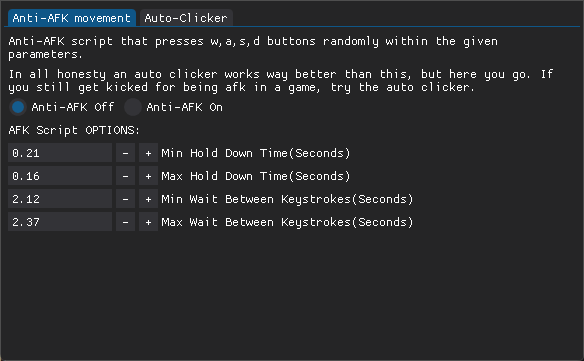

## This should be a program to launch all sorts of shortcuts and scripts from. 

---

The point of this sofware is not to cheat in games. Or at least I personally do not see Anti-Afk measures (automated random movement & Autoclickers) as "Cheats".

---

I have way more useful features planned for the future, but for now I am learning Python from scratch, so this is my way of easing into it.

### Here are some things I want to add in the future:

1. Open App with Hotkey
2. Auto Clicker
3. App launch hotkey
4. App launch buttons
    - lets you press a button to launch one or more apps (and maybe files) with one click
5. Incorporate WFCU (Windows File Conversion Utility) into this program

(WFCU is a program i made to convert images into other formats with just a few clicks from the context menu (webp → png) )

## Currently Working On:

Auto Clicker